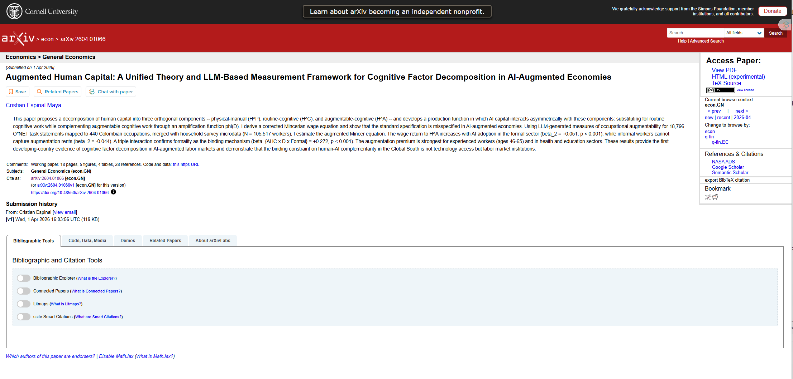
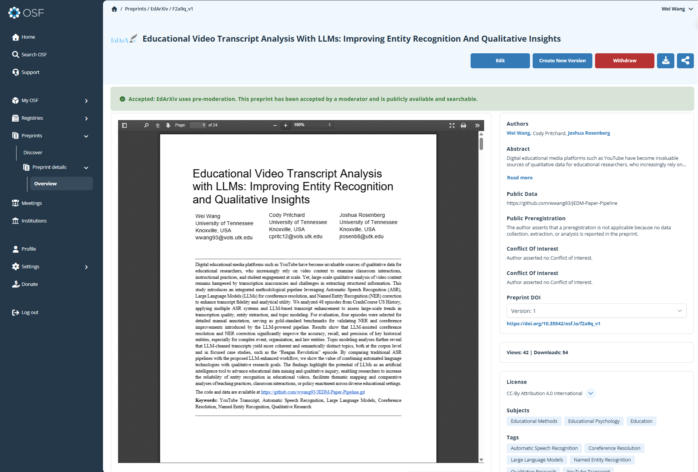
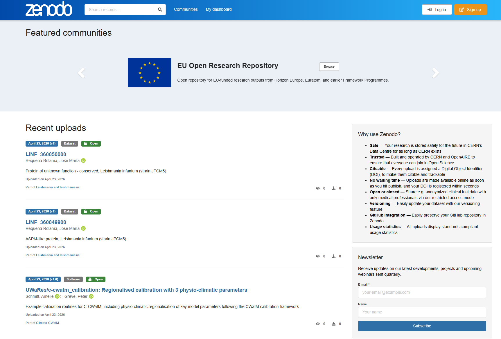
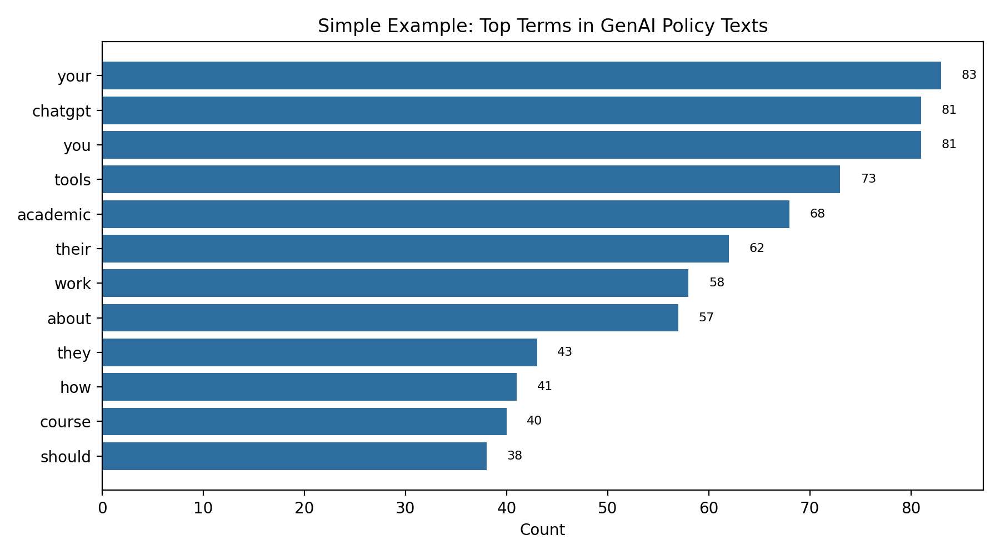

## 11.1 Overview

Computational approaches enable educational researchers to analyze increasingly complex and large-scale data. However, the value of these analyses ultimately depends on how clearly and responsibly findings are communicated [@Wilke2019DataViz; @Healy2018DataViz]. Communication is not a final step added after analysis — it is an integral part of making research meaningful, interpretable, and usable [@Gopen1990ScienceWriting].

Poor communication can obscure otherwise rigorous analyses, while effective communication can extend the reach of research beyond academic journals to educators, designers, policymakers, and students. In computational educational research, communication also involves technical decisions about formats, platforms, and levels of transparency [@Nosek2015OpenScience].

In this chapter, we introduce common ways researchers communicate computational work, with particular attention to open, reproducible, and web-based approaches [@Xie2018RMarkdown]. We then demonstrate how a complete computational analysis — introduced earlier in this book — can be communicated using a Quarto-based project website.

## 11.2 Common Ways to Communicate Computational Educational Research

Educational researchers use a range of formats and platforms to share computational work. Each approach reflects trade-offs among accessibility, formality, reproducibility, and audience.

### 11.2.1 Traditional Journal Publications

Peer-reviewed journal articles remain the dominant mode of scholarly communication in education. Journals provide formal review, editorial oversight, and long-term archiving.

Examples of education journals that publish computational and data-intensive work include:

- *Educational Researcher*: <https://journals.sagepub.com/home/edr>
- *Journal of Learning Analytics*: <https://learning-analytics.info/>

While journal articles are essential for academic recognition, they often impose constraints on length, visualizations, and methodological detail. As a result, many computational decisions—such as preprocessing steps or parameter choices—may be summarized rather than fully documented.


### 11.2.2 Preprints and Open Science Repositories

Preprint servers allow researchers to share manuscripts publicly before or during the peer-review process. These platforms support rapid dissemination and open feedback.

Common platforms include:

- **arXiv**: <https://arxiv.org/>
- **PsyArXiv**: <https://psyarxiv.com/>
- **Open Science Framework (OSF)**: <https://osf.io/>

Preprints are particularly useful for computational research, where methods evolve quickly and early visibility can support collaboration. Researchers should always confirm that their target journals permit preprint posting.





### 11.2.3 Project Websites and Living Documents

Increasingly, computational researchers publish project websites that combine narrative, code, figures, and links to data. These sites allow authors to present analyses without the spatial constraints of traditional articles.

As a concrete example, the workflow below uses the `data-edu/tidyLPA` project [@Rosenberg2018tidyLPA]:

<https://github.com/data-edu/tidyLPA>

<https://data-edu.github.io/tidyLPA>

A common workflow involves:

- Hosting source files and code on **GitHub** (<https://github.com/>)

  

- Publishing a static website using **GitHub Pages** (<https://pages.github.com/>)

  

- Authoring documents with **Quarto** (<https://quarto.org/>)

This approach supports transparency, reproducibility, and incremental updates. Project websites are especially well suited for method demonstrations, teaching examples, and analyses involving multiple visualizations.


### 11.2.4 Open Data and Code Archives

Dedicated repositories allow researchers to share datasets, analysis scripts, and documentation in citable form.

Popular platform such as:

- **Zenodo**: <https://zenodo.org/>

These services issue persistent identifiers (DOIs), enabling datasets and code to be cited independently of articles. A common practice is to host active development on GitHub while archiving stable releases on Zenodo.



## 11.3 Choosing an Appropriate Communication Strategy

No single communication method is optimal for all projects. Researchers should consider their intended audience, goals, and constraints.

For example:

- Journal articles are essential for scholarly recognition.
- Preprints support rapid and open dissemination.
- Project websites allow rich, transparent presentation of computational workflows.
- Data repositories ensure long-term access and citability.

In practice, many projects use **multiple complementary channels**, such as a journal article accompanied by a public website and an archived dataset.

## 11.4 Case Study: Communicating a Text Analysis with Quarto

In earlier chapters, this book introduced frequency-based text analysis as a method for exploring patterns in large collections of educational texts. In this section, we shift focus from *conducting* analysis to *communicating* it. Specifically, we demonstrate how an existing computational study can be shared as a public, reproducible, and accessible research artifact using Quarto.

The case study draws on the frequency-based analysis of generative AI (GenAI) usage guidelines from 100 U.S. universities presented in Chapter 2. Rather than reproducing the analytical steps, the goal here is to illustrate how such work can be communicated effectively to a broader audience through a project website.

### 11.4.1 From Analysis to Communication

Traditional journal articles often summarize computational workflows due to space limitations. In contrast, web-based formats allow researchers to present narrative explanations, code, visualizations, and documentation in a single, integrated environment.

For the GenAI policy analysis, a communication-oriented artifact should allow readers to:

- understand the research context and questions,
- inspect analytical decisions at a high level,
- view results alongside interpretation,
- and access code and data when appropriate.

Quarto (<https://quarto.org/>) provides a flexible framework for producing such artifacts, enabling researchers to write plain-text documents that render into polished websites.

### 11.4.2 Overview of the Communication Artifact

In this example, the analysis is communicated as a Quarto-based project website hosted via GitHub Pages (<https://pages.github.com/>). The website includes:

- a landing page describing the research context,
- a dedicated analysis page summarizing methods and findings,
- embedded figures generated from R,
- and links to data and code repositories.

This format supports transparency and reproducibility while remaining accessible to readers without advanced programming backgrounds.

### 11.4.3 Project Structure

A minimal project structure for communicating the GenAI policy analysis is shown below:

```         

genai-policy-analysis/

├── _quarto.yml

├── index.qmd

├── analysis/

│ └── frequency-analysis.qmd

├── data/

│ └── University_GenAI_Policy_Stance.csv

└── README.md
```

This organization separates communication documents from raw data and supports reuse and extension.

### 11.4.4 Website Configuration

The project is configured as a Quarto website using the `_quarto.yml` file:

``` yaml
project:
  type: website

website:
  title: "GenAI Usage Guidelines in Higher Education"
  navbar:
    right:
      - text: "Analysis"
        href: analysis/frequency-analysis.html
```

This configuration enables navigation between pages and produces a static website suitable for public hosting.

### 11.4.5 Communicating the Analysis in a Quarto Document

The core communication document (`frequency-analysis.qmd`) integrates brief narrative text with one clearly interpretable output. For this chapter, we keep the example intentionally simple and reuse the Chapter 2 frequency analysis idea.

A minimal communication excerpt could look like this:

```{r}
#| eval: false
library(tidyverse)
library(tidytext)

policies <- read_csv("data/University_GenAI_Policy_Stance.csv")

top_terms <- policies |>
  unnest_tokens(word, Stance) |>
  anti_join(stop_words, by = "word") |>
  count(word, sort = TRUE) |>
  slice_head(n = 12)
```

Then, in the communication page, we show one simple bar chart with short interpretation text.



### 11.4.6 Presenting Results for Interpretation

Instead of emphasizing technical implementation, the website focuses on interpretive clarity. For example, a bar chart displaying the most frequent terms highlights the prominence of words such as *assignment*, *student*, and *writing*, emphasizing institutional attention to coursework and academic expectations.

Narrative text accompanying the visualization explains how these patterns relate to broader concerns about academic integrity, instructor authority, and ethical AI use. This integration of visual and narrative elements helps prevent misinterpretation of descriptive computational results.

### 11.4.7 Publishing and Sharing

For the GenAI policy case in this chapter, publishing follows the same two-layer model introduced in Section 9.2.3:

- a **source layer** (repository with Quarto files, scripts, and documentation), and
- a **public layer** (rendered static site for readers).

This separation supports both versioned development and stable public communication. The same pattern can be adapted to course projects, policy analyses, and larger collaborative studies.

### 11.4.8 Why This Format Matters

Communicating the GenAI policy analysis as a web-based artifact offers several advantages:

- Readers can engage with results at their own pace.
- Methods and assumptions are documented transparently.
- The analysis can be updated as policies evolve.
- The artifact supports both research dissemination and teaching.

Importantly, this approach complements rather than replaces traditional publications. A journal article may present the core findings, while a project website provides extended documentation and resources.

### 11.4.9 Summary

This case study illustrates how a frequency-based text analysis can be transformed into a communicative research product using Quarto. By shifting emphasis from computation to interpretation and accessibility, researchers can extend the reach and impact of computational educational research beyond static manuscripts.

## 11.5 Benefits of Web-Based Communication

Communicating computational research through project websites offers several advantages:

- **Transparency**: Readers can inspect code, data, and assumptions.
- **Reproducibility**: Analyses can be rerun and extended.
- **Flexibility**: Content can be updated as methods or data evolve.
- **Pedagogical value**: Websites serve as learning resources for students and practitioners.

These benefits complement, rather than replace, traditional academic publications.

## 11.6 Ethical and Responsible Communication

When communicating computational analyses in education, researchers must attend to ethical considerations. These include protecting student privacy, avoiding deficit-oriented narratives, and clearly stating methodological limitations.

Public-facing materials should avoid revealing identifiable information and should transparently acknowledge sources of bias or uncertainty. Responsible communication ensures that openness does not come at the expense of ethical research practice.

## 11.7 Data Availability and Reproducibility Statement

All executable workflows in this book are intended to be reproducible from repository materials. Core datasets used in chapter analyses are stored under `data/`, and rendered outputs are published under `docs/`.

To support transparency, we distinguish between two types of examples:

- **Executable analysis workflows**: code and data that generate the chapter outputs.
- **Illustrative templates**: non-executed demonstration snippets included for pedagogical purposes (for example, generic network or scraping patterns).

Reproducibility in this book is supported through versioned source files (`.qmd`), explicit data paths, and documented model/tool configurations in chapters that use LLM-assisted methods.

## 11.8 Summary

This chapter emphasized that communication is a methodological choice, not merely a presentation task. Computational educational research benefits from communication strategies that align with open science, reproducibility, and audience needs.

A practical checklist for communicating computational research includes:

- Research questions align with data and methods
- Analytical decisions are documented transparently
- Code and data are accessible when possible
- Visualizations support interpretation rather than replace explanation
- Ethical considerations are explicitly addressed
- Communication formats match the intended audience

Together, these practices support rigorous, responsible, and impactful computational educational research.