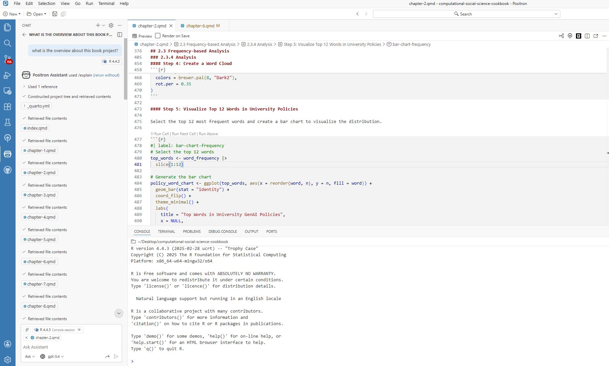
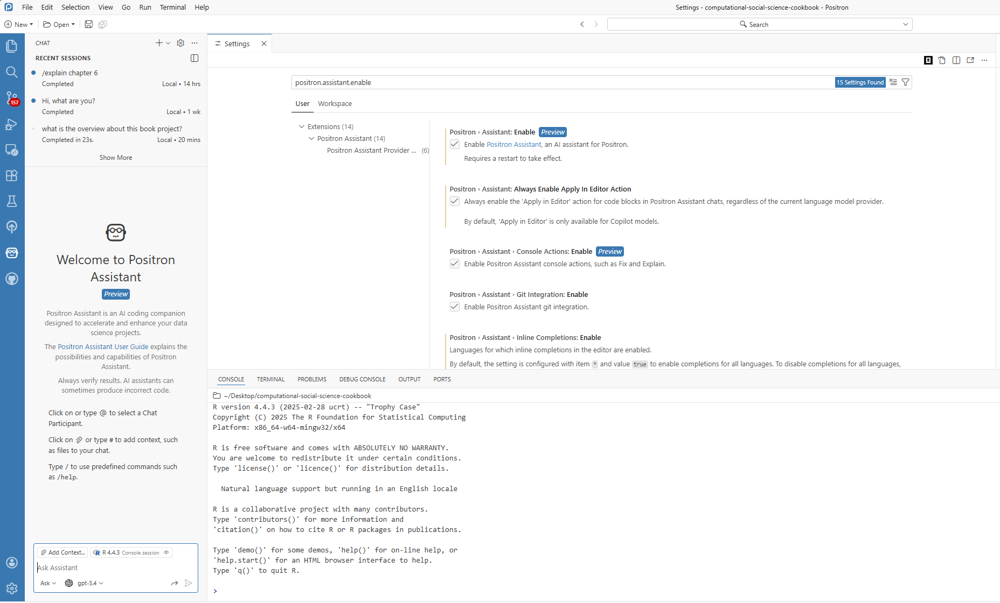
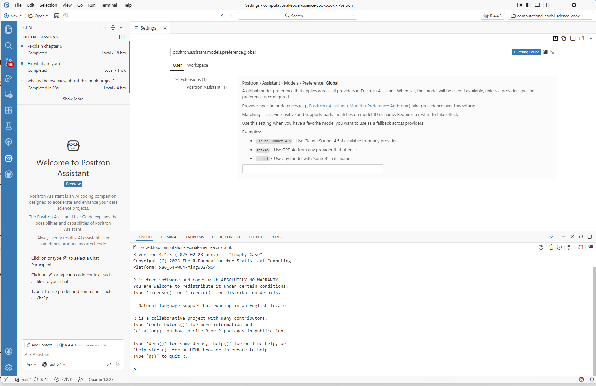
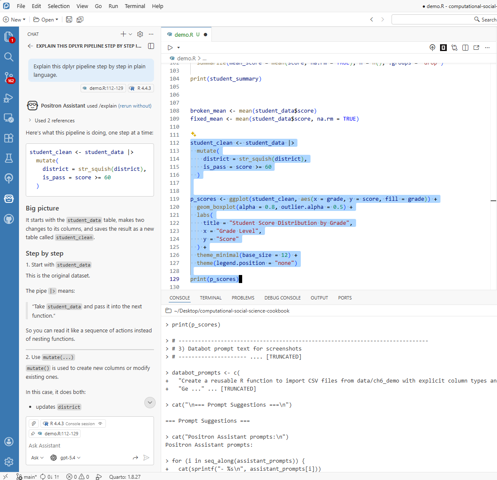
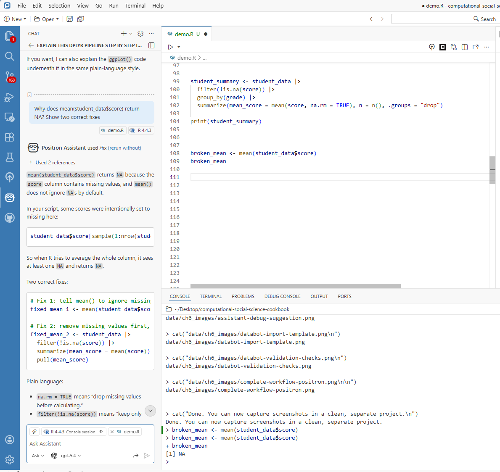
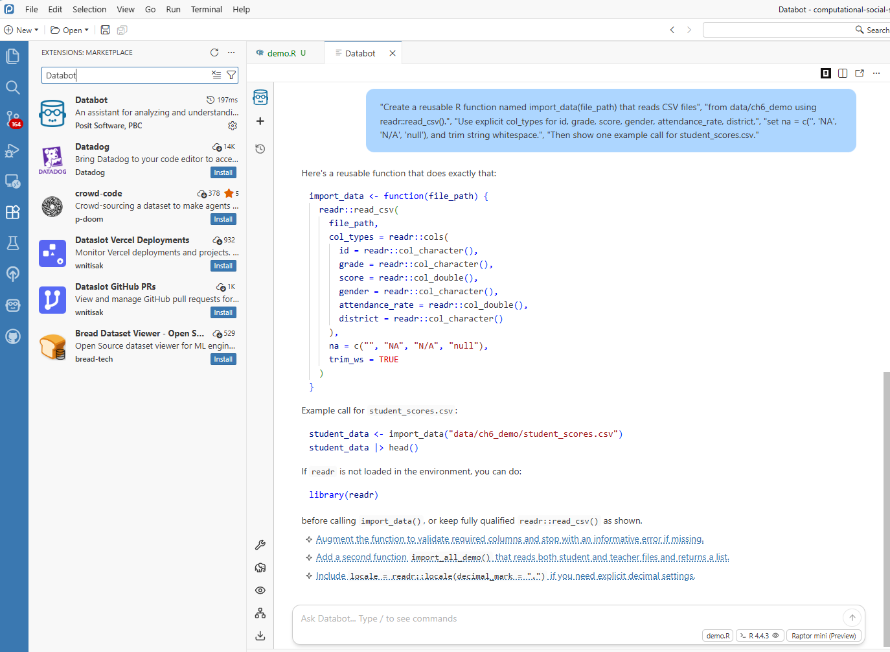
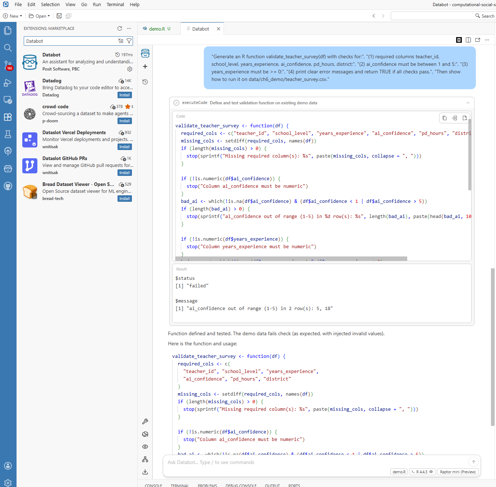
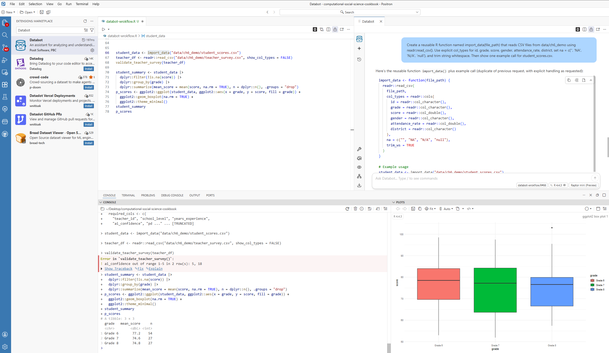

```{r}
#| eval: false
#| include: false
options(warn = -1)
```

## 6.1 Overview

The use of AI tools to assist with research coding and analysis has grown rapidly in educational research. Early comparisons of hand-coding and computer-assisted methods showed meaningful trade-offs between the two approaches [@Nelson2021FutureCoding], and recent work has demonstrated that large language models can perform qualitative coding with sufficient reliability for many research tasks — though with important caveats about where they work well and where they do not [@Than2025UpdatingCoding; @Liu2025GPT4Coding]. This chapter introduces two tools that bring LLM assistance directly into the R and Positron workflow, making these capabilities accessible without requiring researchers to leave their analysis environment.

Positron Assistant functions as an in-IDE research coding assistant: it can support drafting, debugging, and code interpretation without requiring researchers to move between multiple tools. In this chapter, we focus on two tools in the same ecosystem: **Positron Assistant** and **Databot**.

Positron Assistant is the primary pathway in this chapter for chat, inline support, and code suggestions. Databot is presented as an optional exploratory extension, since it is currently in research preview.

The chapter is written for readers with different levels of R experience, with emphasis on practical workflows that can be validated and documented.

## 6.2 Positron Assistant in the Research Workflow

Positron Assistant can use project and workflow context to provide more relevant support than generic chatbot responses.

### 6.2.1 What Can It Do?

Core capabilities include:

-   **Code Suggestions**: Not just basic autocomplete, but context-aware snippets that can help you move from intent to working code more quickly.

-   **Code Explanation**: Select a code block and request an explanation in plain language.

-   **Bug Detection Support**: When code fails, Positron Assistant can inspect errors and suggest fixes.

-   **Code Generation**: Provide a plain-language request (for example, grouped summaries with missing-value handling) to draft R code.

-   **Refactoring**: Propose cleaner versions of working code and explain tradeoffs.



### 6.2.2 Why Would an Educational Researcher Want This?

For educational researchers, the value is not replacement of expertise but support for routine analytical tasks:

-   **Saving time on repetitive tasks** — for example, drafting common data-transformation patterns.

-   **Learning new approaches** — suggestions often expose analysts to alternative R workflows.

-   **Reducing debugging overhead** — error interpretation and fix suggestions are available in context.

-   **Building confidence for newer R users** — iterative feedback can lower the barrier to experimentation.

> **A gentle reminder:** Positron Assistant is a tool to work *with*, not a replacement for your expertise as a researcher. It is great at generating code, but you are the expert on your data and research questions. Always review what it generates—treat it as a first draft that needs your expert polish.

## 6.3 Getting Started

### 6.3.1 What You Will Need

Before we dive in, make sure you have:

-   **Positron** installed (use a current release; Positron Assistant documentation currently tracks the 2025.07+ generation of features)
-   At least one configured **model provider** (for example, Anthropic, GitHub Copilot, OpenAI, Amazon Bedrock, or Snowflake Cortex)
-   **R** (version 4.0 or later) installed on your machine

You should also know your institution's guidance on external AI tools before using non-public data.

### 6.3.2 Setting Things Up

Getting started is straightforward:

1.  **Download and install Positron** from the website
2.  **Enable Positron Assistant** by turning on `positron.assistant.enable` in Settings
3.  **Reload Positron** (restart or run `Developer: Reload Window`)
4.  **Configure a provider** with `Positron Assistant: Configure Language Model Providers`
5.  **Open chat** (robot icon or `Chat: Open Chat`) and start asking questions



### 6.3.3 Making It Feel Right for You

Positron Assistant can adapt to your style. In settings, you can adjust:

-   How detailed responses should be (brief vs. thorough)
-   Whether it prefers tidyverse-style code or base R
-   Whether generated code should include comments

Tune these settings based on your workflow and project requirements.



### 6.3.4 Choosing a Provider for Research Work

If you are working in educational research settings, choose providers with your workflow constraints in mind:

-   **Compliance first**: If your institution restricts providers, follow that policy before convenience.
-   **Cost awareness**: API-key providers are often usage-based; budget and monitor token usage.
-   **Reproducibility**: Record provider + model name in your methods notes.
-   **Stability**: Keep one default model for a project to reduce output variability.

For most readers, a good starting strategy is simple: pick one approved provider, use one primary model for the project, and document those decisions.

### 6.3.5 Optional: Local Agent Setup with Continue + LM Studio

If your project requires local execution, you can run an assistant workflow entirely on your own machine by combining Continue in Positron with a local model served from LM Studio. This path is especially useful when your workflow requires tighter data control.

Below is a practical setup order that matches a real configuration process.

1.  **Start in Positron and define local-model JSON settings first.**

    This ensures your assistant config already points to a local endpoint before you start testing.

    

2.  **Set up LM Studio and confirm the local server is running.**

    Open LM Studio, load your target model, and verify the local API/server endpoint is active.

    

3.  **Configure Continue in Positron to use the LM Studio endpoint.**

    Confirm provider/model mapping in Continue settings and ensure the selected model is the same one currently loaded in LM Studio.

    

    If your Continue workflow is YAML-based, configure the same endpoint and model there as well:

    

4.  **Run a quick in-IDE verification prompt.**

    Use a small, low-risk task first (for example, "Explain this dplyr pipeline" or "Draft a data cleaning function") to verify response quality and latency.

    

5.  **Run one concrete case example before using the workflow in research analysis.**

    This final check confirms that local agent behavior is stable enough for your chapter-level tasks.

    

In short, configure Positron first, confirm LM Studio second, wire Continue third, and only then move to examples. This sequence avoids most connection and model-mismatch errors.

## 6.4 Using Positron Assistant

After setup, the following examples illustrate common usage patterns.

### 6.4.1 Getting Code Explained

Code explanation is useful when adapting snippets from tutorials, collaborators, or prior projects.

1.  Highlight the confusing code
2.  Ask Positron Assistant for a step-by-step explanation
3.  Review the plain-language interpretation

This feature is especially useful for onboarding new team members and documenting analysis logic.



### 6.4.2 When Things Break

A common debugging scenario is shown below:

```{r}
#| eval: false
#| error: true
# You run this, and R throws an error
mean(student_data$score)
```

Instead of manually searching external forums first, pass the error to Positron Assistant for an initial diagnosis. A typical response might be:

> "I see the issue! You are trying to calculate a mean, but there are missing values in your data. Add `na.rm = TRUE` to ignore them, or decide whether those NAs should be handled differently. Want me to show you both options?"

This response can be used as a starting point for verification.



## 6.5 Meet Databot (Experimental): Your EDA Accelerator

If Positron Assistant is your coding colleague, Databot is your exploratory analysis accelerator. It is designed for rapid, iterative data exploration and can generate and run short analysis steps.

Databot is currently experimental (research preview), so treat it as an acceleration layer for exploration, not as an unreviewed source of final results.

### 6.5.1 What Can Databot Handle?

Example tasks include:

-   **Generating import templates** — instead of writing "read.csv()" from scratch every time you get a new dataset, let Databot create a reusable function
-   **Building data cleaning pipelines** — those steps you do every single time (convert text to lowercase, strip whitespace, handle missing values) can be automated
-   **Creating report templates** — if you generate similar reports quarterly, Databot can build the skeleton for you
-   **Setting up quality checks** — automated tests that catch data problems before they become headaches

### 6.5.2 Example: Never Write Import Code Again

Databot can generate reusable import templates for recurring file structures:



``` r
# This template was created once, now you use it forever!
library(readr)
library(here)

import_data <- function(file_path) {
  read_csv(
    file = here("data", file_path),
    col_types = cols(
      id = col_character(),
      score = col_double(),
      grade = col_factor(),
      .default = col_character()
    ),
    na = c("", "NA", "N/A", "null")
  ) |>
  mutate(across(where(is.character), str_squish))
}

# Now importing is one line:
# student_data <- import_data("student_scores.csv")
```

The resulting function can reduce repeated setup work across similar datasets.

### 6.5.3 Example: Automatic Quality Checks

For incoming survey datasets, Databot can draft validation checks before substantive analysis begins:



``` r
# Auto-generated validation checks - run these on every new dataset
validate_student_data <- function(df) {
  checks <- list(
    check_columns_exist = function(d) {
      required <- c("id", "score", "grade")
      missing <- setdiff(required, names(d))
      if (length(missing) > 0) stop("Missing columns: ", paste(missing, collapse = ", "))
      TRUE
    },
    check_no_missing_id = function(d) {
      if (any(is.na(d$id))) stop("Missing IDs found")
      TRUE
    },
    check_score_range = function(d) {
      if (any(d$score < 0 | d$score > 100, na.rm = TRUE)) {
        stop("Scores out of valid range (0-100)")
      }
      TRUE
    }
  )
  
  for (check in checks) {
    check(df)
  }
  message("All validation checks passed!")
  TRUE
}
```

This creates a repeatable validation layer that can be applied whenever new data arrive.

## 6.6 Using These Tools in Research Practice

### 6.6.1 A Concrete Example

To keep this chapter reproducible, use the demo files from `data/ch6_demo/`: `student_scores.csv` and `teacher_survey.csv`.

In this example workflow, you can:

-   ask Databot to draft an import function for `student_scores.csv` (Section 6.5.2),
-   ask Databot to generate validation checks for `teacher_survey.csv` (Section 6.5.3),
-   use Positron Assistant to refine or explain the generated code,
-   run the cleaned analysis pipeline and produce a quick plot for reporting.

The screenshot below should show this end-to-end flow in one workspace view: editor code, Databot/Assistant output, Console results, and a plot. The goal is not to present final publication results, but to document a realistic AI-assisted analysis process from import to quality checks to exploratory output.



### 6.6.2 What This Means for Your Research

The key value is not only speed, but allocation of researcher attention. When routine coding demands are reduced, more effort can be directed toward:

-   Understanding your data deeply
-   Choosing the right analytical approaches
-   Thinking critically about what your findings mean
-   Communicating results effectively to your audience

## 6.7 Working Responsibly with AI Helpers

These tools are useful, but they do not replace researcher judgment. Responsible use requires explicit verification and documentation.

### 6.7.1 Always Review What You Get

Treat AI-generated code like a first draft from a well-meaning but imperfect colleague. It might be mostly right, but it is probably not perfect. Before you use any code it generates in actual research:

-   **Test it on a small sample** first—run the code on a subset of your data to make sure it does what you expect
-   **Verify the results** against something you know to be true, or compare with a manual calculation
-   **Add your own comments** explaining what the code is doing, especially if the logic is complex

### 6.7.2 Be Transparent

If AI tools are used in a research workflow, report that usage transparently in the methods section. For example:

> "We used the Positron AI Assistant to help generate initial data processing code, which was then reviewed and validated by the authors."

This makes the analytic process easier for readers to evaluate and replicate.

### 6.7.3 Keep Things Reproducible

A few tips to make sure your work still holds up:

-   **Note what version** of the AI tools you used
-   **Keep your human-written code** as the authoritative version—do not rely solely on what the AI generated
-   **Use version control** (like Git) to track changes, so you can always see the history of your work

### 6.7.4 Protect Data and Document AI Use

For AI-assisted workflows, keep a short project log with:

-   Positron version
-   provider name (for example, Anthropic or GitHub Copilot)
-   model name
-   date/time of major AI-assisted runs
-   what was AI-generated vs. researcher-edited

Also remember the privacy boundary: Positron routes requests to your selected provider. Posit documents that it does not store your prompts and AI conversations, but your chosen provider may have its own data retention policy. Review provider terms before using sensitive data.

## 6.8 Wrapping Up

This chapter highlights a practical integration pattern:

Positron Assistant and Databot can support repetitive coding tasks, contextual learning, and exploratory analysis. They do not replace domain expertise or methodological oversight.

Used well, they amplify core researcher strengths: question design, contextual interpretation, and critical evaluation of evidence.

### Key Points to Remember

-   Positron Assistant offers real-time code help, explanations, and debugging support
-   Databot can accelerate exploratory analysis and repetitive scaffolding, but requires careful review
-   Always review and validate AI-generated code—it is a starting point, not the final answer
-   Being transparent about AI use builds trust with your readers
-   These tools free you up to focus on what matters: your research

### What is Next?

The next chapter extends this discussion to **local LLM workflows for text analysis**, with emphasis on privacy-preserving qualitative methods.
