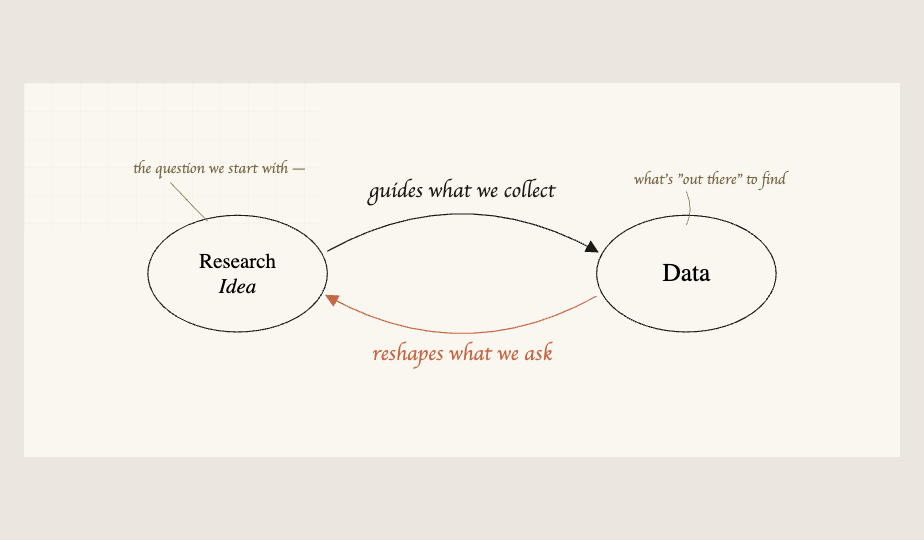
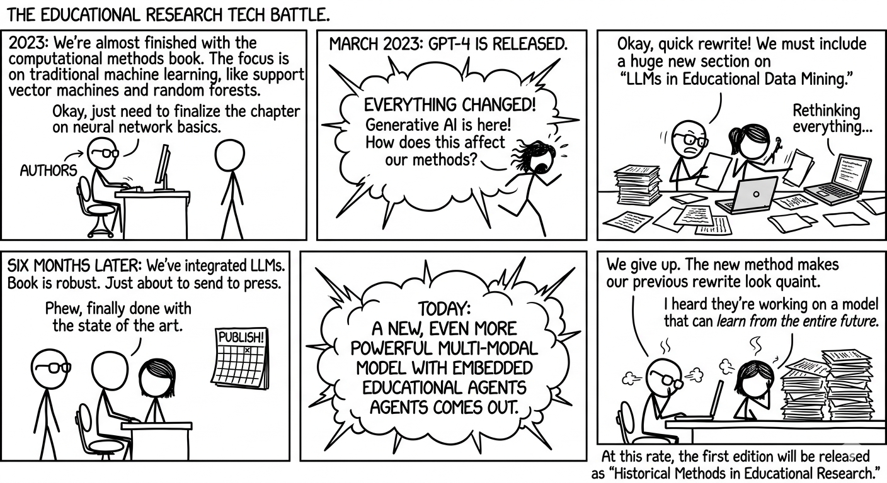

::::::::: {.content-visible when-format="html"}
:::::::: book-cover
{.book-cover-image}

::: book-cover-kicker
Computational Social Science Cookbook
:::

::: book-cover-title
Computational Analysis of Educational Data
:::

::: book-cover-subtitle
A Field Guide Using R
:::

::: book-cover-meta
Wei Wang, Mete Akcaoglu, Joshua Rosenberg, Shaun Kellogg
:::

::: book-cover-meta
Methods, examples, and write-up templates for text, network, numeric, and LLM-based analysis.
:::
::::::::
:::::::::

::: {.content-visible when-format="pdf"}
{fig-align="center" width="5.8in"}

\newpage
:::

Welcome to *Computational Analysis of Educational Data: A Field Guide Using R*!

### Why this book?

Conventionally, as educational researchers, we start the research process by generating research questions based on our previous knowledge and theories in the field. This is the normative view of how the research process should work. But we are limited in how we see the world: we do not know what we do not know. For example, someone who does not know that social media posts can be collected and analyzed as data to capture the state of the world will most likely not develop research questions about such data. This reveals that it is also epistemologically possible for our observations of the world to guide our research questions — that discovering what can serve as data shapes what we can ask as research questions [@Salganik2019BitByBit].

In practice, the research process does not always proceed in the orderly, linear fashion suggested by the conventional model. Once you start seeing what can be data in the world, it shapes your ideas of what is "researchable." Here is a simple model that we propose showing the reciprocal nature of the research process, which is central to our aims in this book:

We are writing this book because in the past few years what we described above has started happening for us. We have published work on social media data, social network analysis, natural language processing, and machine learning that was only possible after we learned what kind of data already existed around us [@Estrellado2020DataScience]. We thought other educational researchers may benefit from a resource that not only tells them what is available as data but also guides them through concrete examples of going through this research journey along with us. We hope that along this journey you will develop your own research questions, and maybe even replicate some of the studies we imagined in this book.

A second distinctive feature of this book is the "field guide" process we use to work through research design and reporting. Although there are many books on R (or Positron), they usually cover the data science aspects of the work, leaving the academic writing and reporting to individuals. Although researchers are expert in writing up conventional methods or results, these emerging data analysis methods (thanks to new ways data has become available) require a new guidebook. For each computational research method, we follow this process:

1.  Start with what makes good data for that analysis (and how to capture it)

2.  See what the data looks like (what it \*\*has to \*\*have, and what it can have)

3.  Formulate sample research questions based on the resources provided by the data and the type of analysis.

4.  Go through the analyses in R

5.  Provide a sample write up for Methods

6.  Provide a sample write up for Results

### What we mean by computational methods

By *computational methods*, we mean research approaches that leverage the power of computing to collect, process, and analyze data at a scale or speed not possible through traditional means. This includes methods that fall under the umbrella of data science — such as text analysis, social network analysis, and machine learning — as well as the emerging use of generative AI and large language models as research tools [@Romero2010EDM; @Siemens2013LA; @Estrellado2020DataScience]. These approaches are sometimes grouped under educational data science, learning analytics, or educational data mining, depending on the community and tradition [@Lang2017HandbookLA; @Krumm2018LA].

Computational social science [@Lazer2009CSS] is an ally field that has advanced many of the methods we draw on. But we focus specifically on educational research, where the data, questions, and stakes have distinctive features — among them, the prevalence of sensitive student data, the importance of equity and context in interpretation, and the goal of understanding, describing, predicting, and impacting learning and teaching.

### LLMs in computational analysis

As this book developed, another major shift emerged in our own work: large language models (LLMs) became part of everyday computational analysis. We do not see LLMs as a replacement for the methods in this book (e.g., text mining, network analysis, or machine learning). Instead, we treat them as an additional methodological layer that can support coding, interpretation, synthesis, and communication.

In practice, this means we use LLMs in at least three ways: as assistants for writing and debugging code, as tools for structured analysis workflows under researcher supervision, and as analytic partners for qualitative and multimodal data. Across all three uses, our approach remains the same as the rest of this field guide: start with a clear research question, make data and analytic decisions explicit, and validate outputs before drawing conclusions.

Because LLM-assisted analysis introduces new opportunities and risks, we also emphasize responsible use throughout the book. We encourage readers to evaluate LLM-supported work through three core criteria: correctness, transparency, and reproducibility. In other words, LLMs can help us see more in the data, but they should never reduce the rigor of how we do research.

### This Book Vs. The AI Timeline

We did not write this book in a quiet methodological era. We started with a strong computational methods plan, thought we were almost done, and then watched the AI landscape change faster than our chapter drafts. More than once.

The comic below captures that very real author experience: every time we felt "finally, this version is stable," a new model release arrived and politely informed us that stability is a temporary concept.

Instead of treating this as a disaster, we used it as a design principle. Keep the foundations (text, network, numeric methods), integrate new AI workflows where they are genuinely useful, and make responsible use explicit at every step.

{fig-align="center"}

*Figure. A comic-style reflection of how this book evolved alongside rapid AI changes (generated with Gemini, based on the authors' storyline).*

### Data and reproducibility note

This book is designed to be reproducible with openly available project files and datasets. Most executable chapter workflows use data stored in the repository under `data/`, so readers can run analyses locally without relying on hidden inputs.

Some snippets are intentionally included as illustrative templates (for example, showing a generic data-loading or network-construction pattern). These are pedagogical examples and are not part of the core executed analysis chain.

For a formal data-availability and reproducibility statement, see Chapter 9.

### Who is this book for?

This book will be beginner-friendly but not for the absolute beginner. We will dedicate the initial chapters to take you to resources that will help you get started. But, to make sense of this book, you should have basic research design knowledge, basic statistical knowledge, and a basic understanding of R and RStudio. At the same time, this book will not be for experts or expertise. There are already many great resources that delve into the topics that we cover (e.g., Silge's book on using text data for machine learning).

We imagine that this book can become a part of doctoral coursework for future researchers, opening the doors for new ways to look at the world for research and data. Likewise, senior and junior academics/researchers would benefit greatly from this book to help them expand their research agendas.

For researchers like ourselves, we think this book can serve as a fun summer reading to rejuvenate and get excited about new research. At the same time, we also envision this book as a guidebook to keep on the side and frequently refer to, as researchers write up their work using these new methods.

This book will provide new ways to look at the world and formulate RQs. It will guide through the research process for each new method (including, friendly data organization tips, template for writing up and sharing this. We hope that you join us in this journey and this work will help open up new doors/embark on a journey of using computational research methods.

### Organization of the Book

The book is organized around four sections. Within these sections, there are specific chapters, which serve as field guide “entries” or "cases". While the section overviews (the first chapter within each section) introduce the techniques or methodologies used in the rest of the section’s chapters, the chapters are intended to address a specific, narrow case, where we provide a sample write-up for researchers in writing their research questions, methods, results (and discussions) sections based on the analyses.
